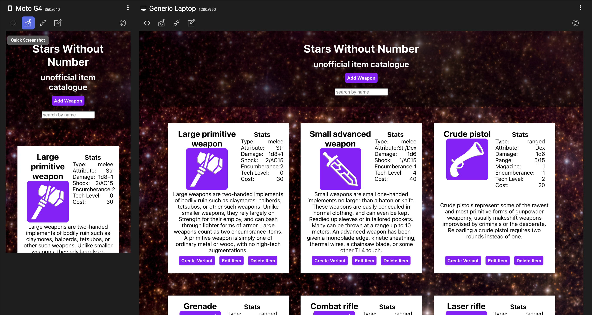

# Stars Without Number Unofficial Item Catalogue

A simple CRUD web application that allows for the searching, editing, creating, and deleting of items from the tabletop roleplaying game Stars Without Number. Create a new item from scratch, or choose an existing item and use it's existing stats to create a brand new variant!

This project was bootstrapped with [Create React App](https://github.com/facebook/create-react-app). The backend repo can be found [here](https://github.com/davidvdev/one-day-mern-backend).

---
## Tech Stack
- Frontend
    - Deployed on [Vercel](https://vercel.com/)
    - React.js
        - with React Router
    - Sass
- Backend
    - Hosted on [Heroku](https://www.heroku.com/)
    - MongoDB
    - Express.js
    - Node.js

## Authors
| David Vogel | [GitHub](https://github.com/davidvdev) | [LinkedIn](https://www.linkedin.com/in/davidvdev/) |
| :---: | :---: | :---: | 

## Acknowledgments
- [Stars Without Number](https://www.drivethrurpg.com/product/230009/Stars-Without-Number-Revised-Edition-Free-Version) by Kevin Crawford
- [game-icons.net](https://game-icons.net/) for the wonderful weapon icons
- [Tanner's SWN Item JSON Collection](https://github.com/tannerstephens/swn-json)

